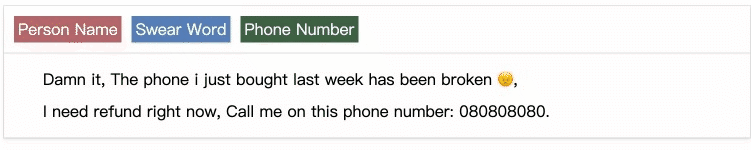

<p align="center">

</p>

A super lightweight javascript library for manual data masking.

# Manual data masking ?

Manual data masking is an operation that label and hide sensitive data, create new text that hides (masks) sensitive information.

Imagine that there is a customer comment which includes sensitive data like swear word, person name, home address...

e.g.

```html
Damn it, The phone i just bought last week has been broken 😠, I need refund
right now, Call me on this phone number: 080808080.
```

By using `manual-data-masking` you can do manual data masking job like this:



Of course, data masked and text after data masking will be generated by `manual-data-masking` at the same time:

data masked:

```js
[
  {
    content: "Damn it",
    category: "Person Name",
    start: 0, // start index in text string
    end: 7, // start index in text string
  },
  {
    content: "080808080",
    category: "Phone Number",
    start: 120,
    end: 129,
  },
];
```

text after data masking:

```html
*******, The phone i just bought last week has been broken 😠, I need refund
right now, Call me on this phone number: *********.
```

[Online preview](https://igykl.csb.app/)

[](https://codesandbox.io/s/easy-data-masking-igykl?file=/index.html)
# How to use in your project

## ES modules

```bash
npm install manual-data-masking
```

```js
import { create as createManualDataMasking } from "manual-data-masking";

const dataMasked = [
  {
    "content": "Damn it",
    "category": "Person Name",
    "start": 0,
    "end": 7
  }
]

const categories = [
  {
    "value": "Person Name",
    "color": "#b6656c"
  },
  {
    "value": "Swear Word",
    "color": "#577eba"
  },
  {
    "value": "Phone Number",
    "color": "#3e6146"
  }
]

const text = "Damn it, The phone i just bought last week has been broken 😠, \n I need refund right now, Call me on this phone number: 080808080."

const $manualDataMasking = createManualDataMasking({
  container: document.getElementById("demo"),
  text,
  dataMasked,
  categories,
  replaceCharactor: "*",
  dataMaskingCharactor: "X",
  maxHeight: 100
})

$manualDataMasking.on("afterDataMasking", (dataMasked, textAfterDataMasking) => {
  console.log(JSON.stringify(dataMasked));
  console.log(textAfterDataMasking);
})
</script>

```

## Script tag:

```html
<script src="https://unpkg.com/manual-data-masking"></script>

<script>
  const dataMasked = [
    {
      content: "Damn it",
      category: "Person Name",
      start: 0,
      end: 7,
    },
  ];

  const categories = [
    {
      value: "Person Name",
      color: "#b6656c",
    },
    {
      value: "Swear Word",
      color: "#577eba",
    },
    {
      value: "Phone Number",
      color: "#3e6146",
    },
  ];

  const text =
    "Damn it, The phone i just bought last week has been broken 😠, \n I need refund right now, Call me on this phone number: 080808080.";

  const $manualDataMasking = manualDataMasking.create({
    container: document.getElementById("demo"),
    text,
    dataMasked,
    categories,
    replaceCharactor: "*",
    dataMaskingCharactor: "X",
    maxHeight: 100,
  });

  $manualDataMasking.on(
    "afterdataMasking",
    (dataMasked, textAfterDataMasking) => {
      console.log(JSON.stringify(dataMasked));
      console.log(textAfterDataMasking);
    }
  );
</script>
```

## Options

| Property             | Description                                                                                                                                                                                            | Type               | Required | Default |
| -------------------- | ------------------------------------------------------------------------------------------------------------------------------------------------------------------------------------------------------ | ------------------ | -------- | ------- |
| categories           | Categories of sensitive data. <br>e.g.<br> [{ <br> &nbsp;&nbsp;value: "Person Name", <br> &nbsp;&nbsp;color: "#3e6146" <br> }, <br> {<br> &nbsp;&nbsp;value: "Bad word"<br>}] <br> Notice: if you don't set color property, the default color will be #577eba | array              | true     | null    |
| container            | Container dom element.                                                                                                                                                                                  | Dom Element Object | true     | null    |
| dataMasked           | Sensitive data been masked.<br>e.g.<br>[{<br>&nbsp;&nbsp;content: "Damn it",<br>&nbsp;&nbsp;category: "Person Name",<br>&nbsp;&nbsp;start: 0, // start index in text string<br>&nbsp;&nbsp;end: 7, // end index in text string<br>&nbsp;}]                                                                                                                                                                             | array              | false    | []      |
| dataMaskingCharactor | Charactor in data masking. entity                                                                                                                                                                       | string             | false    | '●'     |
| maxHeight            | Max height of container, you can scroll the content if the height of container is over maxHeight.                                                                                                       | number             | false    | null    |
| replaceCharactor     | Charactor be used to replace the sensitive. data                                                                                                                                                        | string             | false    | "\*"    |
| text                 | Origin text content. <br> Notice: please use `\n` in where you want to wrap a new line                                                                                                                   | string             | true     | null    |

## Instance functions

|    Name    | Description                                                                      |
| :---------------------: | -------------------------------------------------------------------------------- |
|      getDataMasked      | Get sensitive data been masked <br/> `$manualDataMasking.getDataMasked()`        |
| getTextAfterDataMasking | Get text after data masking <br/> `$manualDataMasking.getTextAfterDataMasking()` |

## Events

|  Event Name  | Description                                                                         |
| :----------: | ----------------------------------------------------------------------------------- |
| afterDataMasking | Registered callback functions will be triggered when new sensitive data been masked. Value of text after masking and data msked can be used inside of the callback function. <br><br> $manualDataMasking.on( "afterdataMasking", (dataMasked, textAfterDataMasking) => {<br> &nbsp;&nbsp;console.log(JSON.stringify(dataMasked));<br> &nbsp;&nbsp;console.log(textAfterDataMasking);<br>});|


## Vue2 version
`manual-data-masking` has another version made with Vue.js 2.x: https://github.com/HC200ok/vue2-text-annotation


## Build Setup

```bash
# install dependencies
npm install
# serve with hot reload at localhost:8080
npm run dev
# build for production with minification
npm run build
```
