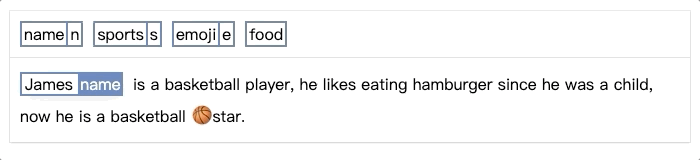

# easy-sequence-labeling-box
> It's an easy javascript plugin for sequence labeling, supporting key shortcuts for faster labeling.

### Concept
```javascript
// initial annations:
[
    {
        "word": "James",
        "label": "name"
    }
] 
```
<font size=8 color=#577eba>↓</font><br/>
<br/>
<font size=8 color=#577eba>↓</font><br/>
```javascript
// latest annotaions: 
[
    {
        "word": "James", 
        "label": "name"
    }, 
    {
        "word": "basketball",
        "label": "sports"
    }, 
    {
        "word": "🏀 ",
        "label": "emoji"
    }
]
```

### Use CDN Script: 
<script></script>

### Demo
have a try

### Options
| Props       | Description              | Type   | Must Required | Default   |
| ----------- | ------------------------ | ------ | ------------- | --------- |
| annotations | labeled data             | Array  | no            | []        |
| labels      | label value and keypress | Array  | yes           |           |
| text        | text                     | String | yes           |           |
| color       | theme color              | String | no            | '#577eba' |

### Functions
| Function Name  | Description                |
| :------------: | -------------------------- |
| getAnnotations | get the latest annotations |